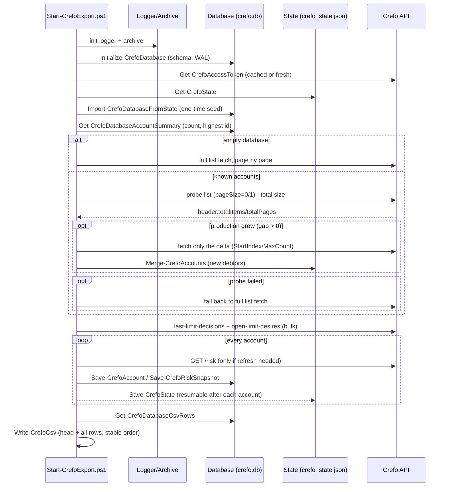
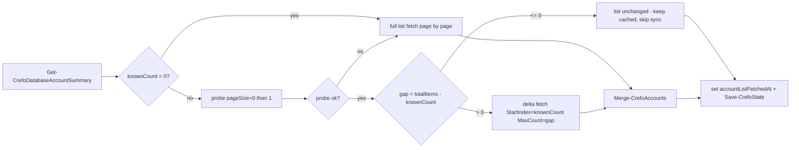
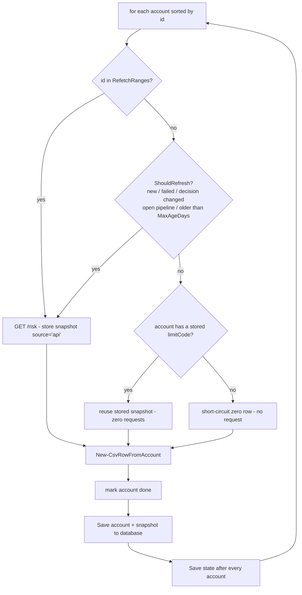
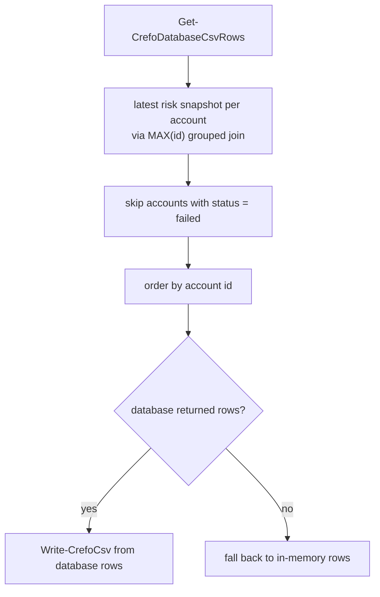
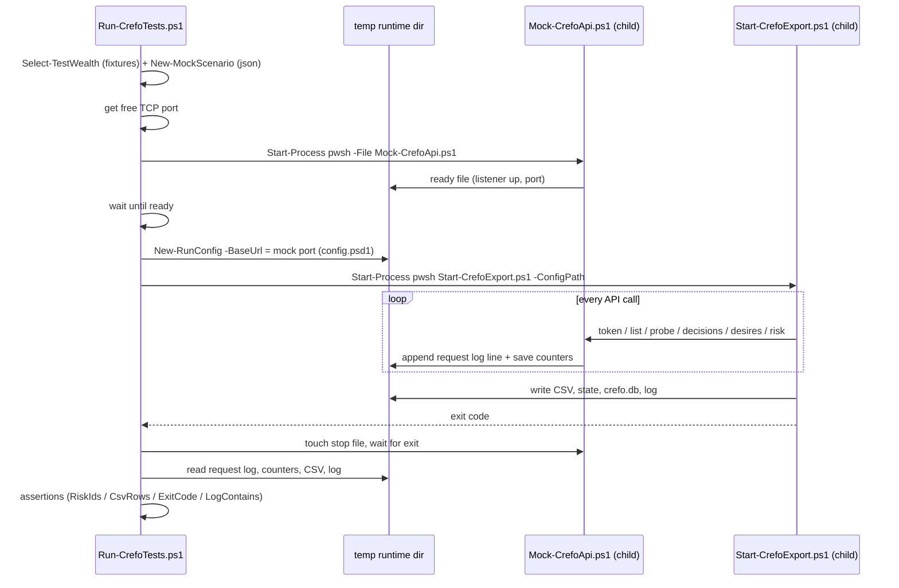
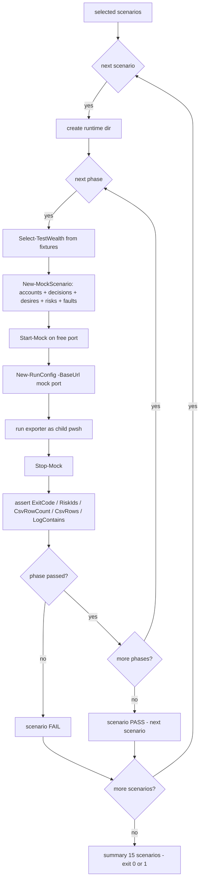
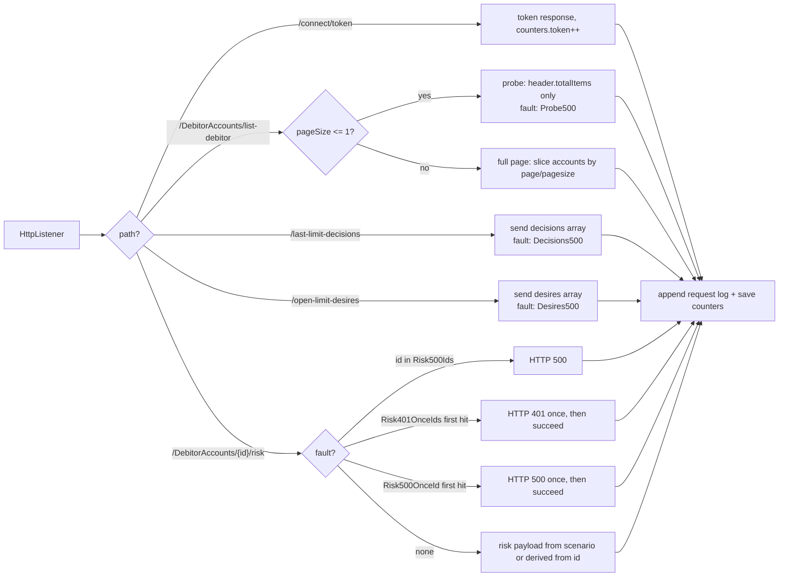

# Crefo Factoring - Limit Export (PowerShell)

Exports debtor limit data from the Crefo Factoring REST API into a CSV file:

```
Kto-Nr.;Name1;Limit;LimitKennz;Gekauft;freie Linie
1014;Irgendeine Firma Service AG;0,00;N;0,00;0,00
```

## Requirements

- PowerShell 7 (pwsh) on any OS, or Windows PowerShell 5.1+.
- API credentials (username, password, client_id, client_secret) from your CrefoFactoring representative.

## Setup

1. Install PowerShell: `winget install Microsoft.PowerShell` (Windows) or `brew install --cask powershell` (macOS).
2. Copy the example config and fill in your credentials:

   ```bash
   cp container-becker/config.example.psd1 container-becker/config.psd1
   ```

3. Edit `config.psd1`. Alternatively, set the same values via environment variables
   (these override the config file):
   `CREFO_USERNAME`, `CREFO_PASSWORD`, `CREFO_CLIENT_ID`, `CREFO_CLIENT_SECRET`,
   `CREFO_BASE_URL`, `CREFO_OBLIGO`.

   > `config.psd1` contains secrets and is git-ignored. Never commit it.

## Run

```powershell
pwsh -File container-becker/Start-CrefoExport.ps1
```

This appends rows to `container-becker/output/crefo_limits.csv` and skips accounts
that were already processed successfully on a previous run.

### Options

| Flag                 | Effect                                                     |
| -------------------- | ---------------------------------------------------------- |
| `-ConfigPath <path>` | Use a different config file (default: `./config.psd1`)     |
| `-Reset`             | Restart from scratch: reprocess all accounts, truncate CSV |
| `-ForceToken`        | Ignore the cached access token and re-authenticate         |
| `-RefetchRanges <r>` | Force a `/risk` refetch for these debtor ids/ranges, e.g. `"1014,1100-1200"` (overrides the config value) |
| `-Verbose`           | Additional verbose output                                  |

Exit code is `0` on success and `1` when at least one account failed (retryable).

## What happens on each run

1. **Authenticate** (`POST /connect/token`, OAuth2 password flow). The token is cached
   in `state/crefo_token_cache.json` and reused until it expires.
2. **Discover the account list** (`GET /api/v1/DebitorAccounts/list-debitor`).
   The list is paginated and each response carries `header.totalItems`/`totalPages`.
   - First run / empty database: the **full list** is fetched, page by page.
   - Otherwise the database is checked first (how many accounts we already know and
     the highest known id). The production list is then **probed** with the smallest
     possible request (`pageSize=0`, falling back to `1`) to read the total size.
     If the totals match, the cached list is kept and the full sync is **skipped**
     (one request instead of a page walk). If production is larger, the **difference**
     (the trailing accounts) is fetched by offset and merged, so only the new debtors
     are requested. A probe failure degrades to the safe full-list fetch.
   Fetched account IDs are merged into the persistent state, so new debtors are picked
   up and old progress is never lost.
3. **Limit-workflow bulk calls** (`GET /api/v1/last-limit-decisions` + `GET /api/v1/open-limit-desires`,
   one call each). Their union is the set of accounts with a live limit context. Accounts in
   **neither** list have no limit and are written straight to the CSV as `0,00;N;0,00;0,00`
   without a `/risk` request. If these bulk calls fail, the script falls back to fetching
   `/risk` for every account.
4. **Risk data per debtor with a limit context** (`GET /api/v1/DebitorAccounts/{debitor}/risk`) -
    the stored snapshot decides whether a call is needed (see `SyncMode`/`MaxAgeDays`).
    Debtors listed in `RefetchRanges` (or `-RefetchRanges`) are always re-fetched, overriding
    that decision. Each call is archived under `archive/`, the response is stored in the account
    state, and the account is marked `done`.
5. **CSV rebuild** - the complete CSV is re-written every run (header + all rows, stable order)
   from the stored snapshots, so the file is always complete and unchanged accounts cost zero requests.
6. **Retry / resume**: any account that failed keeps status `failed` and is retried on
   the next run. Failed accounts are omitted from the rebuilt CSV until a later run succeeds.

## Visual overview of the flows

### Overall run



### Account list discovery (probe + delta)



### Per-account risk processing



### CSV rebuild (database is the source of truth)



## Field mapping (API -> CSV)

| CSV column    | API source                                                                          |
| ------------- | ----------------------------------------------------------------------------------- |
| `Kto-Nr.`     | `id` (list-debitor) / `debtorNumber` (risk)                                         |
| `Name1`       | `name` (list-debitor)                                                               |
| `Limit`       | `limit` (risk)                                                                      |
| `LimitKennz`  | `limitCode` (risk)                                                                  |
| `Gekauft`     | `purchasedReceivables` (risk)                                                       |
| `freie Linie` | computed = `limit - Gekauft` (or `limit - balance` if `FreeLineFromBalance = true`) |

Amounts are formatted German-style (decimal comma, `;` separator, UTF-8 with BOM for Excel).

## Config options

| Key                                       | Default                      | Description                                                                                                                                                                                                          |
| ----------------------------------------- | ---------------------------- | -------------------------------------------------------------------------------------------------------------------------------------------------------------------------------------------------------------------- |
| `BaseUrl`                                 | `https://api-test...`        | API base URL (test or production)                                                                                                                                                                                    |
| `Username/Password/ClientId/ClientSecret` |                              | Your API credentials                                                                                                                                                                                                 |
| `ObligoNumber`                            | `$null` (API selects lowest) | Query one specific obligo; admins use `NMNDID-NFKDKDNR`                                                                                                                                                              |
| `PageSize`                                | `50`                         | Items per page when listing accounts                                                                                                                                                                                 |
| `RequestDelayMs`                          | `200`                        | Pause between API requests (be polite to the API)                                                                                                                                                                    |
| `MaxRetries`                              | `5`                          | Retries for transient errors (408/429/5xx/network)                                                                                                                                                                   |
| `LogLevel`                                | `INFO`                       | `DEBUG`, `INFO`, `WARN`, `ERROR`                                                                                                                                                                                     |
| `RefreshAccountList`                      | `true`                       | Re-verify the account list each run to discover new debtors. When the database already holds accounts, the production total is probed with `pageSize=0` (falling back to `1`); if it matches the known account count the full sync is skipped, otherwise only the trailing difference is fetched. Count-based probe: cannot detect renames/substitutions when the totals stay equal. Set to `false` to keep the cached list in all cases. |
| `FreeLineFromBalance`                     | `false`                      | `true` = freie Linie = limit - balance, otherwise limit - purchased                                                                                                                                                  |
| `UseLastLimitDecisions`                   | `true`                       | Skip `/risk` for accounts with no live limit context (not in `last-limit-decisions` or `open-limit-desires`); written as `0,00;N;0,00;0,00`. Disable if a debtor without any limit context can still have purchases. |
| `SyncMode`                                | `Incremental`                | `Incremental` = re-fetch `/risk` only on change/new/age; `RefreshAll` = re-fetch for all accounts with a limit context every run                                                                                     |
| `MaxAgeDays`                              | `7`                          | In `Incremental` mode, force a `/risk` re-fetch for snapshots older than this many days (`0` = no cap). Controls `Gekauft` staleness                                                                                 |
| `RefetchRanges`                           | `''`                         | Comma list of debtor ids / id ranges that are always re-fetched, e.g. `'1014,1100-1200'`. Overrides all incremental decisions (kept fresh despite `MaxAgeDays`/limits). Can also be passed as `-RefetchRanges` on the command line. |
| `ArchiveRequests`                         | `true`                       | Store every request/response/data exchange in `ArchiveDir`                                                                                                                                                           |
| `OutputFileName`                          | `crefo_limits.csv`           | Filename in `OutputDir`                                                                                                                                                                                              |

## Generated artifacts

- `output/crefo_limits.csv` - the results.
- `state/crefo.db` - **canonical** SQLite store (source of truth) the CSV is rebuilt from:
  - `accounts` - one row per debitor (id, name, status, error, created/updated)
  - `risk_snapshots` - append-only history of every `/risk` result (and short-circuit zero rows); latest per account wins
  - `api_exchanges` - audit log of every API call (endpoint, method, url, status, elapsed, archive path)
  Access requires the `sqlite3` CLI (ships with macOS). Writes are batched into
  atomic transactions; a failed statement rolls the whole batch back.
- `state/crefo_state.json` - progress snapshot kept **alongside** the DB for rollback (id, name, status, error, updatedAt). This is what makes runs resumable. Also contains the account list snapshot in the `accounts` array. On the first run after enabled, accounts/snapshots already in this file are copied into the database.

Because `risk_snapshots` stores `fetched_at` and the account id, archive file paths are
reconstructable without extra storage: `archive/risks/<outer-range>/<inner-range>/<debtor-id>-risk/`.

- `state/crefo_token_cache.json` - cached access token (permissions restricted).
- `logs/crefo_export_<timestamp>.log` - per-run log with timestamps and levels.
- `archive/<endpoint>/<timestamp>_<seq>_request.json` / `_response.json` / `_data.json` - every API exchange stored as files:
  - `_request.json`: method, URL (incl. query), redacted headers, request body
  - `_response.json`: HTTP status, content type, elapsed ms, **raw** response body
  - `_data.json`: the decoded/pure JSON data only (no HTTP envelope - this is the "data only" store)

  Endpoints are grouped in folders (`token`, `list-debitor`, ...). All per-debtor risk calls
  are grouped under `archive/risks/<outer-range>/<inner-range>/debtor-<id>-risk/`, bucketed
  by debtor id: outer buckets in 1000-er steps, then an inner 100-er step. For example the
  debtor with id 1234 lands under `archive/risks/1000-1999/1200-1299/debtor-1234-risk/`.
  Secrets never land in the archive: the OAuth token call is stored with credentials and
  the access token redacted, and the `Authorization` header is always written as `Bearer REDACTED`.

## Testing the exporter (scenario tests)

`tests/Run-CrefoTests.ps1` drives the **real** exporter (a child `pwsh` process, so exit
codes are meaningful) against a local mock of the Crefo API (`tests/Mock-CrefoApi.ps1`).
Each scenario is one run directory with one or more *phases*; a phase is one exporter run
against one mock snapshot. Mock responses are composed per phase from the shared fixtures
in `tests/TestData/` plus fault injection, so every feature can be triggered deterministically.

```powershell
pwsh -File tests/Run-CrefoTests.ps1              # run everything
pwsh -File tests/Run-CrefoTests.ps1 -Filter reuse  # only scenarios matching 'reuse'
```

Exit code `0` = all scenarios pass, `1` = at least one failed.

### Test harness (one phase)



### Scenario / phase execution



### Mock server routing & fault injection



### Scenario coverage

| Scenario                     | Feature under test                                              |
| ---------------------------- | -------------------------------------------------------------- |
| `fresh-sync`                 | first run fetches `/risk` for every account                    |
| `incremental-reuse`          | unchanged accounts cost zero `/risk` calls                     |
| `delta-new-account`          | probe detects growth, only the new debtor is fetched           |
| `probe-failure-fallback`     | probe 500 → safe full-list sync                                |
| `v401-token-refresh`         | 401 on `/risk` → token refresh + retry                         |
| `transient-retry-500`        | transient 500 → retry/backoff                                  |
| `failed-account-retry`       | permanent failure → `failed`, no CSV row, retried next run     |
| `refetch-ranges`             | `-RefetchRanges` forces `/risk` regardless of the snapshot     |
| `refresh-all-mode`           | `SyncMode=RefreshAll` refetches all accounts with a context    |
| `decision-removed-refetch`   | active snapshot with no decision → re-fetch                    |
| `open-limit-pipeline`        | account in `open-limit-desires` keeps refreshing               |
| `bulk-call-fallback`         | decisions/desires 500 → fall back to `/risk` for every account |
| `free-line-from-balance`     | `FreeLineFromBalance` switches `freie Linie` computation       |
| `pagination-many-accounts`   | multi-page account list walk                                   |
| `reset-reprocesses`          | `-Reset` reprocesses all accounts from scratch                 |

## Migrating an existing archive / state (one-time)

Older versions stored risk archives differently (flat `archive/debtor-<id>-risk`,
`risks/debtor-<id>-risk`, 1000-er-only buckets, or flat underscore buckets like
`risks_<outer>-<outerEnd>_<inner>-<innerEnd>` produced by an older `ApiArchive` that
flattened the category path). Two tools bring everything to the current layout:

1. **Reorganize the archive folders** (idempotent; preview first):
   ```zsh
   pwsh -File container-becker/Reorganize-Archive.ps1 -ArchiveDir container-becker/archive -DryRun
   pwsh -File container-becker/Reorganize-Archive.ps1 -ArchiveDir container-becker/archive
   ```
   Every `debtor-<id>-risk` folder is moved to
   `archive/risks/<outer-range>/<inner-range>/debtor-<id>-risk/`; the now-empty legacy
   bucket folders are removed.

2. **Backfill account snapshots from the archive** so the next run reuses them instead of
   re-fetching `/risk` for the whole debtor book. Accounts exported before the daily-sync
   snapshot feature carry no stored risk data, so without this the first run would re-fetch
   everything once. Preview first:
   ```zsh
   pwsh -File container-becker/Migrate-StateFromArchive.ps1 -ArchiveDir container-becker/archive -DryRun
   pwsh -File container-becker/Migrate-StateFromArchive.ps1 -ArchiveDir container-becker/archive
   ```
   A timestamped backup of `state/crefo_state.json` is written before any change. Accounts
   with no archived risk are left for a normal `/risk` fetch or the N short-circuit.

## Best practices implemented

- **Logging**: timestamped, leveled log to file + console; a new log file per run.
- **Persistence**: progress, the account list, and every API request/response/data exchange are persisted to disk across runs.
- **Resumability**: completed accounts are skipped; failed ones are retried; state is saved after every single account.
- **Idempotency**: rows are appended once per account; re-running never duplicates data.
- **Security**: secrets live in git-ignored `config.psd1` or environment variables; the token cache is `chmod 600`.
- **Resilience**: retries with a configurable delay + jitter for transient errors, automatic token refresh on `401`.