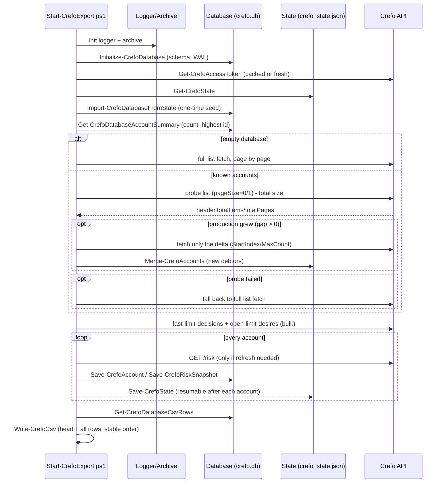
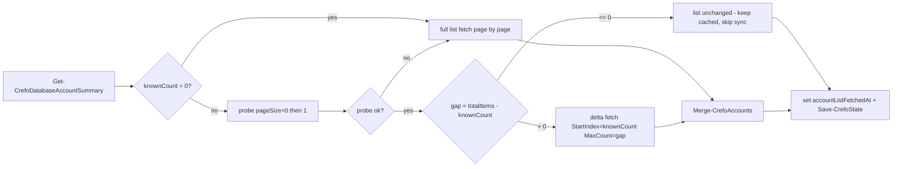
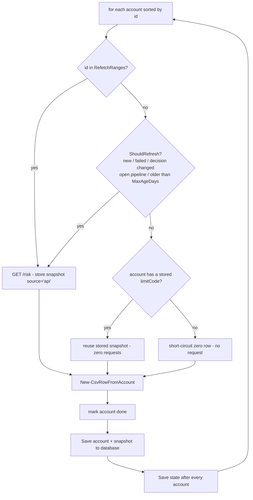
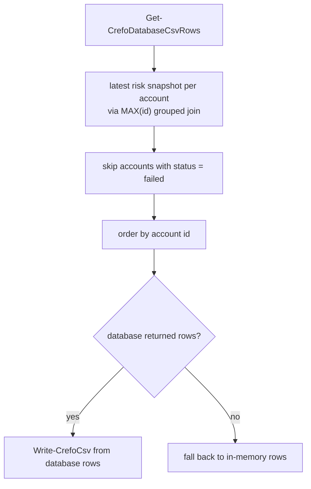
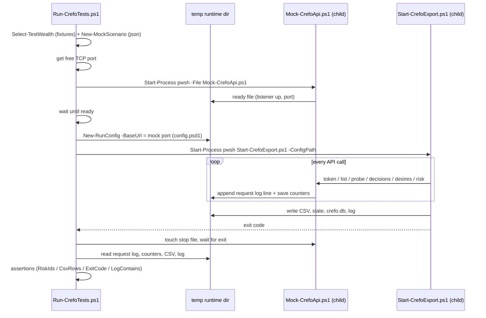
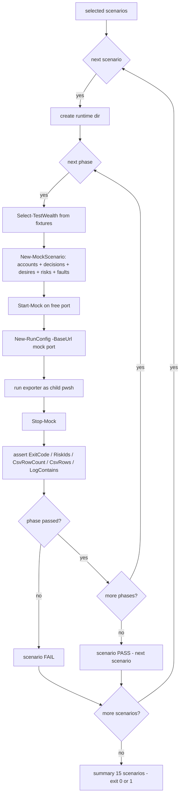
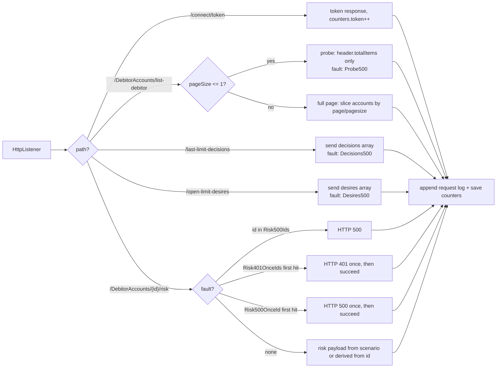

# Flows

## Overall run

## Account list discovery (probe + delta)

## Per-account risk processing

## CSV rebuild (database is the source of truth)

## Test harness (one phase)

## Scenario / phase execution

## Mock server routing & fault injection

